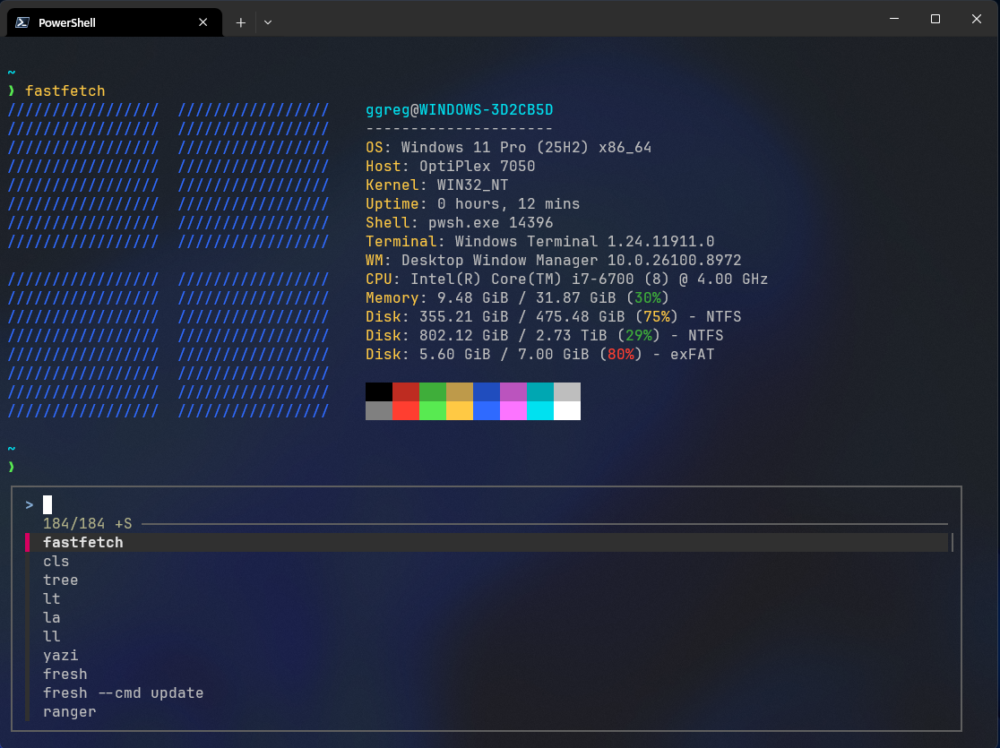
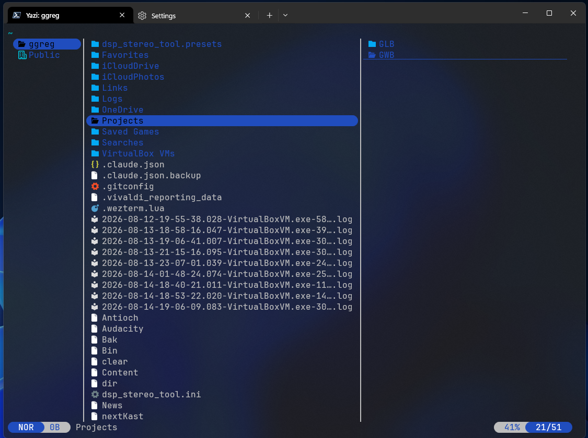

# Greg's Windows Bootstrap (GWB)

The PowerShell/Windows sibling to [GLB](https://github.com/ggregoro/GLB) —
same idea, ported from apt/dnf/pacman/zypper + dotfiles to winget +
PowerShell's `$PROFILE`. One command installs a curated set of terminal
tools and wires up your PowerShell profile, instead of doing it by hand
every time a machine gets reimaged.

## Why GWB?

GLB solves this for Linux; GWB solves it for the Windows boxes in the
same rotation — a modern `ls`/`cat` (`eza`, `bat`), fuzzy search (`fzf`),
fast search (`ripgrep`, `fd`), two terminal file managers (`lf` and
`yazi`, the latter with a git-status plugin pre-configured), and a
clean prompt (Starship), applied in one pass as a reusable **profile**: a
package list plus a `$PROFILE` snippet.

GWB is terminal-first: it enhances whatever terminal you already have
rather than replacing it, and its focus stays the shell and CLI. GUI
apps are added only when they're a deliberate pick that complements that
focus — never a general app menu. See
[`docs/PHILOSOPHY.md`](docs/PHILOSOPHY.md) for the reasoning.

## Screenshots

**A real `fastfetch` system-info banner**, captured on Greg's own
Windows 11 machine, with the GWB-configured Starship `pwsh` prompt
visible below it (`fastfetch` itself isn't a GWB package — Greg
installed it separately):



**`yazi` browsing a real directory**, with the GWB/GLB checkouts visible
in the preview pane:



## Architecture

GWB mirrors GLB's shape directly: a `gwb.ps1` dispatcher sources focused
modules from `lib/` (`banner`, `log`, `detect`, `packages`, `modules`,
`profile`, `completions`, `terminal`, `export`, `diff`, `repair`) and
applies per-profile `packages.txt` + `modules.txt` + `profile-
snippet.ps1` under `profiles/`. Packages are winget IDs resolved from
logical names via an override table (e.g. `fd` → `sharkdp.fd`);
PowerShell Gallery modules go through `Install-Module` instead; the
snippet is injected into `$PROFILE` between marked `# >>> GWB managed
block >>>` / `<<<` lines so a re-apply replaces it cleanly instead of
duplicating it. See [`docs/ARCHITECTURE.md`](docs/ARCHITECTURE.md) for
the full module breakdown.

## Features

- **winget-based package installs**, with logical-name → package-ID
  overrides handled automatically.
- **`$PROFILE` management** — injects a managed, idempotent block into
  your PowerShell profile; re-running `restore` replaces it in place.
- **Backup on first touch, never clobbered after** — a pre-existing
  `$PROFILE` is backed up to `$PROFILE.gwb-backup` before GWB ever
  touches it, and later restores never overwrite that original backup.
- **Dry-run previews** (`restore --dry-run`) and **rollback** (`restore
  --undo`, restores `$PROFILE` from the backup).
- **Interactive profile picker** — `restore` with no profile name lists
  available profiles with descriptions and lets you choose.
- **State export/diff/repair** — `gwb export` snapshots the machine's
  installed subset of known packages plus the current `$PROFILE` block;
  `gwb diff <a> <b>` compares two profiles/snapshots for drift; `gwb
  repair <profile>` checks the machine against a profile and offers to
  fix it; `gwb restore --from-snapshot <name>` reapplies a snapshot;
  `gwb restore --from-manifest <path>` applies a profile-shaped
  directory from anywhere on disk.
- **A `gwb` command + tab-completion**, installed into `$PROFILE`
  automatically on every restore — commands, profile/snapshot names,
  and package names all complete, reading live from disk.
- **PowerShell Gallery modules** (`modules.txt`, `Install-Module`-based)
  for things winget doesn't carry: PSFzf (fzf keybindings), Terminal-
  Icons (file-type icons in `Get-ChildItem`). PSReadLine's predictive
  IntelliSense is configured directly since it already ships with
  PowerShell 7.
- **yazi**, pre-configured with the `git.yazi` status plugin (vendored,
  not fetched at restore time) and a real MIME-type-detection
  dependency (`file`) wired onto `PATH`, since winget doesn't do that
  automatically for either tool. Ported from GLB's own `default`
  profile, then to all three of GWB's.

## Installation

The quickest way — a one-line installer that clones GWB into
`$env:LOCALAPPDATA\GWB` (or updates it in place if already there):

```powershell
irm https://raw.githubusercontent.com/ggregoro/GWB/master/install.ps1 | iex
```

It only sets up the checkout — it deliberately doesn't run
`gwb restore` itself, since that's an opinionated, interactive step
(package installs, `$PROFILE` changes) that shouldn't happen as a side
effect of "get GWB onto my machine." Once it's done, run:

```powershell
& "$env:LOCALAPPDATA\GWB\gwb.ps1" restore
```

Alternatively, clone it yourself and run `gwb` directly:

```powershell
git clone https://github.com/ggregoro/GWB.git
cd GWB
.\gwb.ps1 restore default
```

After the first restore (either way), open a new PowerShell window and
just use `gwb` directly — no more `.\gwb.ps1`.

Running `restore` with no profile name shows an interactive picker
instead of assuming `default`.

## Usage

```
gwb help                    Show all commands
gwb version                 Show GWB version
gwb info                    Show OS/PowerShell/winget info
gwb install <package>       Install a single package
gwb remove <package>        Remove a package
gwb update                  Upgrade all winget-managed packages
gwb restore [profile]       Apply a profile (packages + $PROFILE)
gwb restore --dry-run       Preview a restore without changing anything
gwb restore --undo          Undo the last restore's $PROFILE changes
gwb restore --from-snapshot <name>  Apply a snapshot captured by 'gwb export'
gwb restore --from-manifest <path>  Apply a profile-shaped directory from anywhere on disk
gwb profiles                List available profiles
gwb export                  Snapshot this machine's known packages + $PROFILE
gwb diff <a> <b>            Compare two profiles/snapshots for drift
gwb repair <profile>        Check this machine against a profile
```

## Profiles

| Profile | Installs |
|---|---|
| `default` | `eza`, `fzf`, `lf`, `ripgrep`, `fd`, `bat`, `starship`, `yazi` + `file` (yazi's MIME-detection dependency) + PSFzf/Terminal-Icons + a `$PROFILE` snippet (eza aliases, `bat` as `cat`, fzf options, PSFzf/Terminal-Icons/PSReadLine activation, Starship prompt init). |
| `developer` | `default`'s foundation + `git`, `jq`, `gh`, `mise`, Fresh (editor), MinGW/gcc (build toolchain), Far Manager (file manager). No container tooling — see [`docs/design/developer-profile.md`](docs/design/developer-profile.md). |
| `server` | `default`'s foundation + `restic` (backups), Far Manager (file manager). No firewall/fail2ban/resource-monitor tooling — see [`docs/design/server-profile.md`](docs/design/server-profile.md). |

## Requirements

- Windows 10/11 with PowerShell 7+
- [winget](https://learn.microsoft.com/en-us/windows/package-manager/winget/)
  (`App Installer` from the Microsoft Store)

## Testing

```powershell
Import-Module Pester -MinimumVersion 5.0
Invoke-Pester -Path tests/
```

A [Pester](https://pester.dev/) suite (GWB's analogue of GLB's `bats`
suite) — `winget`/`Install-Module` are mocked and `$PROFILE` is
overridden to a temp path, so it's safe to run; nothing real gets
touched. 103 tests, one file roughly per `lib/` module plus
`Dispatcher.Tests.ps1` for real end-to-end command coverage and
`Install.Tests.ps1` for `install.ps1`. See
[`docs/design/pester-test-suite.md`](docs/design/pester-test-suite.md).

## Status

v1.0.0, Version 1.0 (Stable Release) complete. The dispatcher, package
installs, PowerShell Gallery modules, `$PROFILE` management, all three
profiles (`default`/`developer`/`server`), the full
configuration-management set
(`export`/`diff`/`repair`/`restore --from-snapshot`/`restore
--from-manifest`, tracking both `packages.txt` and `modules.txt`
drift), the `gwb` command + tab-completion, the `install.ps1`
one-liner, and a Pester test suite are all built and verified — real
restores on real machines (idempotency, the backup/undo round-trip,
real drift detection, real `TabExpansion2` results, a real fresh
install + update-in-place against the live public repo) plus 103
automated tests. All of GLB's own Version 0.1–0.6 equivalents are now
ported, and the repo is public. **One deliberate, permanent non-goal**:
IPBan (`server`'s fail2ban equivalent) needs Administrator elevation
and installs a persistent firewall-blocking service with real lockout
risk — decided not to automate at all, see
[`docs/reference/ipban-manual-install.md`](docs/reference/ipban-manual-install.md)
for the manual install instead.

## Project

Vision, target audience, goals, non-goals, and release strategy are
tracked in [`docs/PROJECT.md`](docs/PROJECT.md).

## Roadmap

GWB's direction and current progress are tracked in
[`docs/ROADMAP.md`](docs/ROADMAP.md).

## Contributing

GWB is currently a personal project built and tested by its author on
two real Windows 11 machines, documented in detail in
[`CLAUDE.md`](CLAUDE.md). See [`CONTRIBUTING.md`](CONTRIBUTING.md)
for conventions and [`CODE_OF_CONDUCT.md`](CODE_OF_CONDUCT.md).

## Related

- [GLB](https://github.com/ggregoro/GLB) — the Linux original this
  project ports from.

## License

MIT — see [`LICENSE`](LICENSE).
